```{r setup, include=FALSE}
library(learnr)
library(knitr)
knitr::opts_chunk$set(echo = FALSE)
```


## Introduction

The objectives for today are:

 - Introduce operations between sets;
 
 - Define the concept of functions;
 
 - Characterize various properties of functions;
 
 - Discuss the concept of inverse and composition of functions.
 
## Set Operations

### Union and Intersection

Let $A$ and $B$ be sets. 

 - The *union* of the sets $A$ and $B$ denoted by $A\cup B$ is the set that contains those elements that are either in $A$ or in $B$ or in both, that is 
$$
A\cup B = \{x | x\in A \mbox{ or } x\in B\}
$$

 - The *intersection* of the sets $A$ and $B$ denoted by $A\cap B$ is the set containing those elements in both $A$ and $B$, that is 
$$
A \cap B = \{x| x\in A \mbox{ and } x\in B\}.
$$

The following Venn Diagram illustrates these two operations.

```{r, out.width = "800px"}
knitr::include_graphics("images/venn3.png")
```

### Set Difference and Complement
Let $A$ and $B$ be sets and $U$ be the universal set.

 - The *difference* of the sets $A$ and $B$ denoted by $A - B$ is the set containing those elements that are in $A$ but not in $B$, that is 
$$
A - B = \{x | x\in A \mbox{ an } x\not\in B\}
$$

 - The *complement* of the set $A$ denoted by $\bar{A}$ is $U - A$, that is 
$$
\bar{A} = \{x| x\in U \mbox{ and } x\not \in A\}.
$$

The following Venn Diagram illustrates these two operations.

```{r, out.width = "800px"}
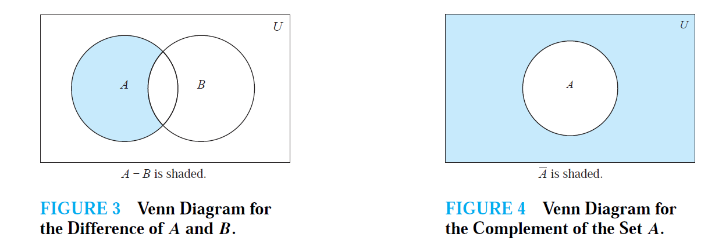
```

### An Example

Let $A=\{1,3,5\}$, $B=\{1,2,3\}$ and $U = \{1,2,3,4,5\}$.

 - $A\cap B = \{ 1,3\}$
 - $A\cup B = \{1,2,3,5 \}$
 - $A - B  = \{5\}$
 - $B - A = \{2\}$
 - $\bar{A} = \{2,4\}$
 -  $\bar{B}= \{4,5\}$

### Test your understanding

Let $A = \{a,b,c,d\}$, $B = \{b,d,f,h\}$ and $U=\{a,b,c,d,e,f,g,h\}$

```{r math, echo = FALSE}
quiz(
  question("What is $A \\cup B$?",
    answer("\\{a,b,c,d,e,f,g\\}"),
    answer("\\{a,b,c,d,e,f\\}"),
    answer("\\{a,b,c,d,f,h\\}", correct = TRUE),
    answer("\\{b,d\\}"),
    allow_retry = TRUE
  ),
  question("What is $A \\cap B$?",
    answer("\\{c,d\\}"),
    answer("\\{b,c\\}"),
    answer("\\{a,c\\}"),
    answer("\\{b,d\\}", correct = TRUE),
    allow_retry = TRUE
  ),
    question("What is $A \\setminus B$?",
    answer("\\{c,d\\}"),
    answer("\\{b,c\\}"),
    answer("\\{a,c\\}",correct = TRUE),
    answer("\\{b,d\\}"),
    allow_retry = TRUE
  ),
    question("What is $\\bar{A}$?",
    answer("\\{e,f,g,h\\}",correct = TRUE),
    answer("\\{a,c,e,g\\}"),
    answer("\\{c,d,e,f\\}"),
    answer("\\{a,b,g,h\\}"),
    allow_retry = TRUE
  )
)
```

## Set Identities

There are multiple, notable identities that hold for the operations we just introduced. Some of these are easy and intuitive, others require a little bit of thinking. However, by drawing the associated Venn diagrams it is easy to see why they are true.

```{r, out.width = "600px"}
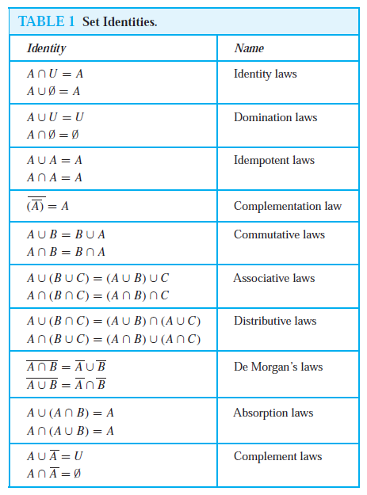
```


### Disjoint sets

Two sets are called *disjoint* if their intersection is the empty set.

```{r math2, echo = FALSE}
question(
  "Which of the following sets are disjoint?",
  answer("$\\{a,b,c\\}$ and $\\{d,e,f\\}$", correct = TRUE),
  answer("$\\{a,c,e\\}$ and $\\{e,f,g\\}$"),
  answer("$\\{a,g\\}$ and $\\{e,f,h\\}$"),
  answer("$\\{a\\}$ and $\\{b,c,d,e,f\\}$", correct = TRUE),
  allow_retry = TRUE
)
```

### Principle of inclusion-exclusion

The *principle of inclusion-exclusion* states that
$$
|A\cup B|= |A| + |B| - |A\cap B|
$$
So we can derive the size of the union of two sets, by knowing the size of the individual set and of their intersection. This will become fundamental when we study probability theory.

```{r math3, echo =FALSE}
question("Without computing $A\\cup B$, what is the size of the union between $A=\\{a,d,f\\}$ and $B=\\{b,c,d\\}$?",
answer("$3 + 3 - 2 = 4$"),
answer("2 + 2 -1 = 3"),
answer("3 + 3 - 1 = 5", correct = TRUE),
answer("3 + 3 - 3 = 3"),
allow_retry = TRUE
)
```

## Generalized Set Operations

 - The *union* of a collection of sets is the set that contains those elements that are members of at least one set in the collection. We use the notation 
$$
A_1\cup A_2 \cup\cdots \cup A_n=\cup_{i=1}^n A_i
$$

 - The *intersection* of a collection of sets is the set that contains those elements that are members of all the sets in the collection. We use the notation 
$$
A_1\cap A_2\cap \cdots \cap A_n=\cap_{i=1}^n A_i
$$

The following Venn diagrams give a visual representation of these concepts.

```{r, out.width = "800px"}
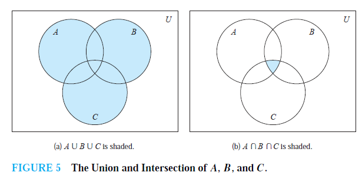
```

### An Example

For $i=1,2,\dots,n$, let 
$$
A_i = \{i, i +1, i+2,\dots\}
$$
So $A_i$ is the set including all integers from $i$ to infinity. Then
$$
\bigcup_{i=1}^nA_i=\bigcup_{i=1}^n\{i,i+1,i+2,\dots\} = \{1,2,3,\dots\}
$$
since $A_2,\dots,A_n$ are all subsets of $A_1=\{1,2,3,\dots\}$. Furthermore
$$
\bigcap_{i=1}^nA_i = \bigcap_{i=1}^n\{i,i+1,i+2,\dots\}=\{n, n+1,n+2,\dots\}= A_n
$$
Since $A_n\subset A_{n-1}\subset A_{n-2}$ and so on.

### Another Example
Union and intersecations can also applied an infinite number of times.

Suppose now that $A_i=\{1,2,3,\dots,i\}$, for $i=1,2,3,\dots$. So $A_i$ is the set of integer numbers from 1 to $i$. Then
$$
\bigcup_{i=1}^{\infty}=\bigcup_{i=1}^\infty\{1,2,\dots,i\}=\mathbb{Z}_+=\{1,2,3,\dots\}
$$
since $A_1\subset A_2 \subset A_3 \cdots$. So the union of all these sets is equal to the set of positive integer numbers. Furthermore

$$
\bigcap_{i=1}^{\infty}=\bigcap_{i=1}^\infty \{1,2,\dots, i\}= \{1\}
$$
following the same reasoning.


### A short quiz
Let $A=\{x\in\mathbb{Z}_+| x \leq 10\}$, $B=\{1,2,3,4,5\}$, $C = \{11,12,13,14,15\}$.
```{r math4, echo = FALSE}
quiz(
  question(
    "What is $A\\cup B \\cup C$?",
    answer("$\\emptyset$"),
    answer("$\\{1,2,3,4,5\\}$"),
    answer("$\\{6,7,8,9,10,11,12,13,14,15\\}$"),
    answer("$\\{1,2,3,4,5,6,7,8,9,10,11,12,13,14,15\\}$",correct = TRUE),
    allow_retry = TRUE
  ),
    question(
    "What is $A\\cap B \\cap C$?",
    answer("$\\emptyset$",correct = TRUE),
    answer("$\\{1,2,3,4,5\\}$"),
    answer("$\\{6,7,8,9,10,11,12,13,14,15\\}$"),
    answer("$\\{1,2,3,4,5,6,7,8,9,10,11,12,13,14,15\\}$"),
    allow_retry = TRUE
  )
)
```

## Functions


### Definition

In many instances we assing to each of a set a particular element of a second set. For example, suppose that each student in a mathematics class is assigned a letter grade from the set $\{A,B,C,D,F\}$. Suppose that the grades are A for Adams, C for Chou, B for Goodfriend, A for Rodriguez and F for Stevens. This assignment is an example of a *function*.

```{r, out.width = "400px"}
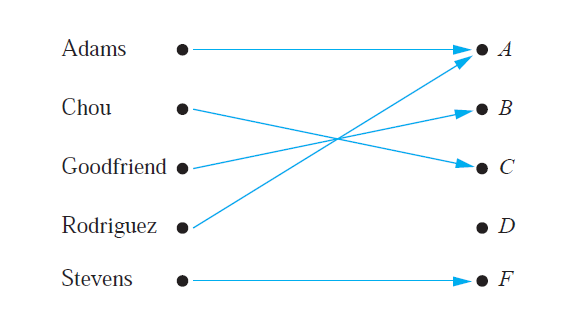
```

Let $A$ and $B$ be nonempty sets. A *function* $f$ from $A$ to $B$ is an assignment of exactly one element of $B$ to each element of $A$. We write $f(a)=b$ if $b$ is the unique element of $B$ assigned by the function $f$ to the element $a$ of $A$. If $f$ is a function from $A$ to $B$ we write $f:A\rightarrow B$.

Functions are specified in many different ways. Sometimes we explicitly state the assignments, as in the maths class example. Often we give a formula, such $f(x)=x+1$. Other times we use a computer program to specify a function.

### Terminology

If $f$ is a function from $A$ to $B$ we say that $A$ is the *domain* of $f$ and $B$ is the *codomain* of $f$. If $f(a)=b$ we say that $b$ is the *image* of $a$ and $a$ is the *preimage* of $b$. The *image* of $f$ is the set of all images of elements of $A$. Also, if $f$ is a function from $A$ to $B$ we say that $f$ *maps* $A$ to $B$.

```{r, out.width = "400px"}
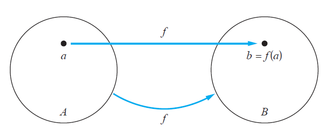
```

### Examples

 - Let $f:\mathbb{Z}\rightarrow \mathbb{Z}$ assign the square of an integer to this integer. Then $f(x)=x^2$, where the domain of $f$ is the set of all integers, the codomain of $f$ is the set of all integers and the image of $f$ is the set of all integers that are perfect squares, namely $\{1,4,9,\cdots\}$.


### A Review Quiz

Consider the example above of the grades of students in a math module.
```{r quiz, echo = FALSE}
quiz(
  question(
    "What is the domain?",
    answer("{Adams, Chou, Goodfriend, Rodriguez, Stevens}",correct = TRUE),
    answer("{A,B,C,D,F}"),
    answer("{A,B,C,F}"),
    answer("{Chou, Goodfriend, Rodriguez, Stevens}"),
    allow_retry = TRUE
  ),
    question(
    "What is the codomain?",
    answer("{Adams, Chou, Goodfriend, Rodriguez, Stevens}"),
    answer("{A,B,C,D,F}",correct = TRUE),
    answer("{A,B,C,F}"),
    answer("{Chou, Goodfriend, Rodriguez, Stevens}"),
    allow_retry = TRUE
  ),
    question(
    "What is the image of the function?",
    answer("{Adams, Chou, Goodfriend, Rodriguez, Stevens}"),
    answer("{A,B,C,D,F}"),
    answer("{A,B,C,F}", correct = TRUE),
    answer("{Chou, Goodfriend, Rodriguez, Stevens}"),
    allow_retry = TRUE
  ),
  question(
    "What is the image of Chou?",
    answer("A"),
    answer("B"),
    answer("C",correct = TRUE),
    answer("F"),
    allow_retry = TRUE
  )
)
```

 
## Types of Functions


### Real-valued Functions

A function is called *real-valued* if its codomain is the set of real numbers, and it is called *integer-valued* if its codomain is the set of integers. 

Let $f_1$ and $f_2$ be functions from $A$ to $\mathbb{R}$. Then $f_1+f_2$ and $f_1f_2$ are also functions from $A$ to $\mathbb{R}$ defined for all $x\in A$ by
$$
(f_1+f_2)(x) =f_1(x)+f_2(x) \hspace{1cm}
(f_1f_2)(x)  = f_1(x)f_2(x)
$$


Let $f_1$ and $f_2$ be functions from $\mathbb{R}$ to $\mathbb{R}$ such that $f_1(x)=x^2$ and $f_x(2)=x-x^2$. Then $(f_1+f_2)(x)=x$ and $(f_1f_2)(x)=x^3-x^4$.

### Injective Functions

A function $f$ is said to be *injective* or *one-to-one* if and only if $f(a)=f(b)$ implies that $a=b$ for all $a$ and $b$ in the domain of $f$.

```{r, out.width = "400px"}
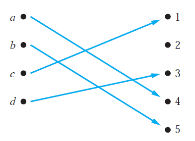
```

What this means is that each element on the right-hand-side of the above picture can be associated to one element only on the left-hand-side.

### Surjective Functions

A function $f$ from $A$ to $B$ is called *surjective* or *onto* if and only if for every element $b\in B$ there is an element $a\in A$ with $f(a)=b$.

```{r, out.width = "400px"}
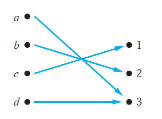
```

What this means is that all elements on the right-hand-side are associated to at least one element on the left-hand-side.

### Bijective Functions


The function $f$ is *bijective* if it is both one-to-one and onto.

Let's look at a summary example.

```{r, out.width = "600px"}
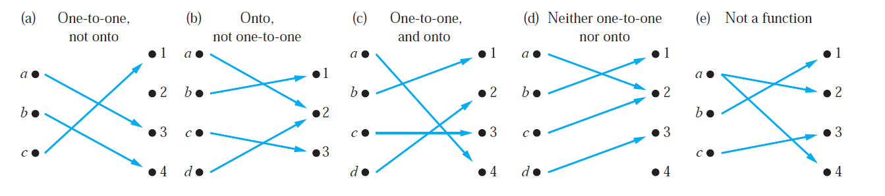
```

 - The function in (a) is injective since $1$, $3$ and $4$ are the image of one element only of the domain ($c$, $a$ and $b$ respectively). It is not surjective since $2$ is not the image of any element in the domain. Thus is not bijective.
 
 - The function in (b) is not injective since $2$ is the image of two elements in the domain, $a$ and $b$. It is surjective since $1$, $2$ and $3$ are the image of at least one element of the domain. Thus is not bijective.
 
 - The function in (c) is injective since $1$, $2$, $3$ and $4$ are the image of one element only of the domain. It is surjective since all elements in the codomain are the image of at least one element of the domain. Therefore it is bijective.
 
 - The function in (d) is neither injective ($2$ is the image of $a$ and $c$) nor surjective ($4$ is not the image of any element of the domain). Thus is not bijective
 
 - The function in (e) is not a function since $a$ is mapped to both $2$ and $4$.
 
Other examples:

 - Consider the function $f(x)=x^2$ from the set of integers to the set of integers. This is not injective since for instance $f(1)=f(-1)=1$ but $1\neq -1$. It is not surjective since for instance there is no integer $x$ with $x^2=-1$. Therefore is not bijective.

 - Consider the function $f(x)=x+1$ from the set of integers to the set of integers. It is injective since $x+1 \neq y+1$ when $x\neq y$. It is surjective since for every integer $y$ there is an integer $x$ such that $f(x)=y$. Therefore it is bijective.

 - Consider the function $f:A\rightarrow A$, such that $f(x)=x$. This is called *identity* function. It is bijective.
 
### A Review Quiz

```{r quizz, echo = FALSE}
quiz(
  question(
    "Which of the following functions from {a,b,c,d} to itself is injective?",
    answer("f(a)=b, f(b)=a, f(c)=c, f(d)=d", correct = TRUE),
    answer("f(a)=b, f(b)=b, f(c)=d, f(d)=c"),
    answer("f(a)=d, f(b)=b, f(c)=c, f(d)=d"),
    allow_retry = TRUE
  ),
    question(
    "Which of the following functions from {a,b,c,d} to itself is surjective?",
    answer("f(a)=b, f(b)=a, f(c)=c, f(d)=d", correct = TRUE),
    answer("f(a)=b, f(b)=b, f(c)=d, f(d)=c"),
    answer("f(a)=d, f(b)=b, f(c)=c, f(d)=d"),
    allow_retry = TRUE
  ),
    question(
    "Which of the following functions from {a,b,c,d} to itself is bijective?",
    answer("f(a)=b, f(b)=a, f(c)=c, f(d)=d", correct = TRUE),
    answer("f(a)=b, f(b)=b, f(c)=d, f(d)=c"),
    answer("f(a)=d, f(b)=b, f(c)=c, f(d)=d"),
    allow_retry = TRUE
  )
)
```
 
### Increasing Functions

A function $f$ whose domain and codomain are subsets of the set of real numbers is called *increasing* if $f(x)\leq f(y)$, and *strictly increasing* if $f(x)<f(y)$ whenever $x<y$ and $x$ and $y$ are in the domain of $f$.

Similarly, $f$ is called *decreasing* if $f(x)\geq f(y)$, and *strictly decreasing* if $f(x)>f(y)$ whenever $x<y$ and $x$ and $y$ are in the domain of $f$.  

 - A function that is either strictly increasing or strictly decreasing must be injective. 

 - A function that is increasing, but not strictly increasing, or decreasing, but not strictly decreasing, is not injective.

We will use frequently the idea of increasing/decreasing functions in calculus of real functions.

## Inverse and Compositions


### Inverse Functions

Let $f$ be a bijective function from the set $A$ to the set $B$. The \emph{inverse function} of $f$ is the function that assigns to an element $b$ belonging to $B$ the unique element $a$ in $A$ such that $f(a)=b$. The inverse function of $f$ is denoted by $f^{-1}$. Hence $f^{-1}(b)=a$ when $f(a)=b$. A bijective function is called \emph{invertible} since we can define its inverse.

```{r, out.width = "600px"}
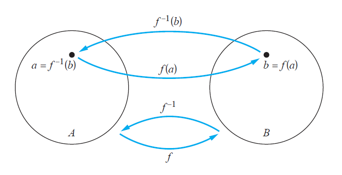
```

 - Let $f:\mathbb{Z}\rightarrow \mathbb{Z}$ be such that $f(x)=x+1$. It is invertible since it is bijective. To find the inverse, suppose that $y$ is the image of $x$ so that $y=x+1$. Then $x=y-1$. This means that $y-1$ is the unique element of $\mathbb{Z}$ that is sent to $y$ by $f$. Thus $f^{-1}(y)=y-1$.

 - Let $f:\mathbb{R}\rightarrow \mathbb{R}$ such that $f(x)=x^2$. It is not invertible since it is not bijective. 

 - However we can restrict the domain and codomain in the previous example. Let $f:\mathbb{R}_+ \rightarrow \mathbb{R}_+$ such that $f(x)=x^2$. One can show that it is bijective and therefore it is invertible. Its inverse can be derived as $f^{-1}(y)=\sqrt{y}$.
 
### A review quiz
Let $f$ be the function from the set $\{a,b,c\}$ to the set $\{1,2,3\}$ such that $f(a)=2$, $f(b)=3$ and $f(c)=1$.  

```{r quizzz, echo = FALSE}
quiz(
  question("What is $f^{-1}(1)$?",
  answer("a"),
  answer("b"),
  answer("c",correct = TRUE),
  allow_retry = TRUE
  ),
   question("What is $f^{-1}(2)$?",
  answer("a",correct = TRUE),
  answer("b"),
  answer("c"),
  allow_retry = TRUE
  ),
    question("What is $f^{-1}(3)$?",
  answer("a"),
  answer("b",correct = TRUE),
  answer("c"),
  allow_retry = TRUE
  )
)
``` 
 
### Composition of Functions

Let $g$ be a function from the set $A$ to the set $B$ and let $f$ be a function from the set $B$ to the set $C$. The *composition* of the functions $f$ and $g$, denoted for all $a\in A$ by $f\circ g$ is defined by $(f\circ g)(a)=f(g(a))$.

```{r, out.width = "600px"}
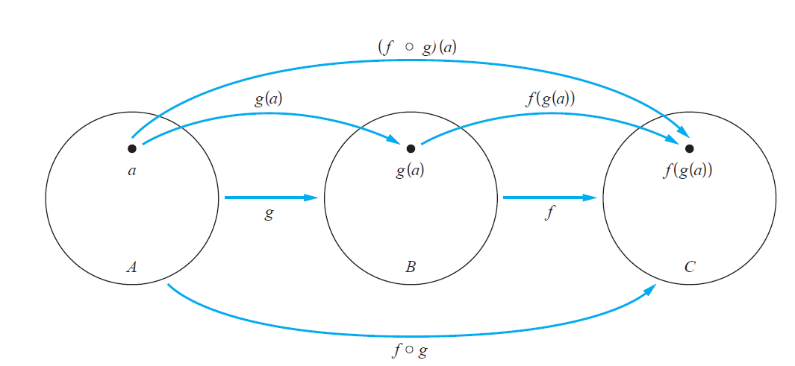
```

 - Let $f$ and $g$ be from $\mathbb{Z}$ to $\mathbb{Z}$ and $f(x)=2x+3$ and $g(x)=3x+2$. Then
$$
(f\circ g)(x)=f(g(x))=f(3x+2)=2(3x+2)+3 =6x+7
$$
$$
(g\circ f)(x)=g(f(x))=g(2x+3)=3(2x+3) +2 = 6x + 11
$$

 - Compositions of a function and its inverse are identity functions:
$$
(f^{-1}\circ f)(a)=f^{-1}(f(a))=f^{-1}(b)=a
$$
$$
(f\circ f^{-1})(b) = f(f^{-1}(b)) = f(a) = b
$$

### A review quiz
Let $g$ be the function from the set $\{a,b,c\}$ to itself such that $g(a)=b$, $g(b)=c$ and $g(c)=a$. Let $f$ be the function from the set $\{a,b,c\}$ to the set $\{1,2,3\}$ such that $f(a)=3$, $f(b)=2$ and $f(c)=1$.  

```{r quizzzz, echo = FALSE}
quiz(
  question("What is $(f\\circ g)(a)$?",
  answer("1"),
  answer("2",correct = TRUE),
  answer("3"),
  allow_retry = TRUE
  ),
  question("What is $(f\\circ g)(b)$?",
  answer("1",correct = TRUE),
  answer("2"),
  answer("3"),
  allow_retry = TRUE
  ),
  question("What is $(f\\circ g)(c)$?",
  answer("1"),
  answer("2"),
  answer("3",correct = TRUE),
  allow_retry = TRUE
  )
)
```

### The Graph of a Function

Let $f$ be a function from the set $A$ to the set $B$. The *graph* of the function $f$ is the set of ordered pairs $\{(a,b) | a\in A \mbox{ and } f(a)=b\}$.

```{r, out.width = "600px"}
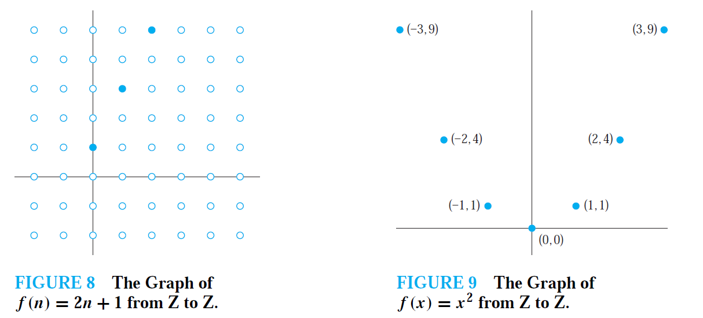
```

We will study graph of functions in more details in calculus of real functions. Let's look more closely the two graphs above:

 - On the left: the function associates to each positive integer, twice the number plus one. So for $n=0 \rightarrow f(n)= 2\cdot 0 + 1= 2$, $n=1\rightarrow f(n)=2\cdot 1 + 1 =3$, $n=2 \rightarrow f(2)= 2\cdot 2 + 1 = 5$ and so on. The blue filled dots report these pairs.
 
 - On the right: the function associate to each integer, the square of that number. So $n=0 \rightarrow f(0) = 0^2$, $n=1 \rightarrow f(1) = 1^2=1$ and so on. The blue filled dots report these pairs.
